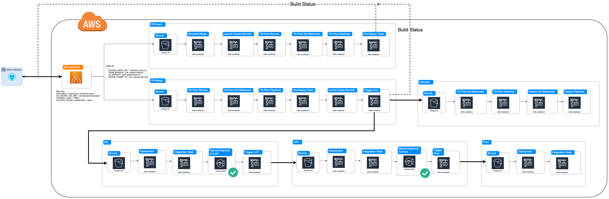

# Launch `common-automation-framework` 2.0 


## 1. Executive Summary:


## 2. Current Architecture

```sh
trigger_pipeline.zip
    - set_vars.sh
        export GIT_REPO="launch-demo-ecs-application"
        export GIT_PROJECT=""
        export GIT_ORG="launchbynttdata"
        export FROM_BRANCH="feature/init"
        export TO_BRANCH="main"
        export MERGE_COMMIT_ID="73eb3498290d01d212853864f71d8fb5c25b036f"
        export GIT_SERVER_URL="https://github.com"
        export CONTAINER_IMAGE_VERSION="73eb3498290d01d212853864f71d8fb5c25b036f"
```


## 3. Proposed Architecture

### 3.1. Repository Structure

```
Repository Structure:
    root:
        - platform/
            - pipline/
            - webhook/
            - ../
        - test/
            - @jim-miller-nttd
        - source/
            - project files
        - .gitignore
        - .secrets.baseline
        - .tool-versions
        - .launch_config
        - Makefile
        - LICENSE
        - README.md
```
### 3.2. `.launch_config` file
```sh
{
    "provider": "aws",
    "accounts": {
        "root": "launch-sandbox-admin",
        "qa": "launch-qa-admin",
        "uat": "launch-uat-admin",
        "prod": "launch-prod-admin"
    },
    "tg_backend_prefix": "demo-ecs_app",
    "skeleton": {
        "url": "https://github.com/launchbynttdata/lcaf-template-terragrunt.git",
        "tag": "1.0.0"
    },
    "sources": {
        "service": {
            "url": "https://github.com/launchbynttdata/tf-aws-module_collection-ecs_app.git",
            "tag": "1.3.1"
        },
        "pipeline": {
            "url": "https://github.com/launchbynttdata/tf-aws-module_collection-codepipeline.git",
            "tag": "1.0.2"
        },
        "webhook": {
            "url": "https://github.com/launchbynttdata/tf-aws-module_reference-bulk_lambda_function.git",
            "tag": "1.1.0"
        }
    },
    "platform": {
        "service": {
            "qa": {
                "us-east-2": {
                    "000": {
                        "tfvars": "./platform/service/qa/us-east-2/000/terraform.tfvars",
                        "templates": {
                            "application": {
                                "properties_file": "./platform/service/qa/us-east-2/000/application.yaml"
                                "secret": "./platform/templates/application/secret.yaml",
                                "non_secret": "./platform/templates/application/non_secret.yaml"
                            }
                        },
                        "additional-files": {
                            "root_file.txt": "./root_file.txt",
                            "renamed_file.txt": "./platform/service/root/us-east-2/000/environment_file.txt",
                            "environment_file.txt": "./platform/service/root/us-east-2/000/environment_file.txt",
                            "nested_rename/renamed_file.txt": "./platform/service/root/us-east-2/000/environment_file.txt",
                        },
                    }
                }
            },
        },
        "deployment-infrastructure": {
            "pipeline": {
                "root": {
                    "us-east-2": {
                        "000": {
                            "tfvars": "./platform/pipeline/root/us-east-2/000/terraform.tfvars"
                        }
                    }
                }
            },
            "webhook": {
                "root": {
                    "us-east-2": {
                        "000": {
                            "tfvars": "./platform/webhook/root/us-east-2/000/terraform.tfvars"
                        }
                    }
                }
            }
        }
    }
}
```

### 3.3. `launch-cli` commands
#### 3.3.1. launch service create
- Should read a `.launch_config` file in the current directory
- Should be ran in a root of an application repo if not creating a new repo.
- Should create the platform folder

Flags:
```sh
--config: [IO File] (Optional) Path to `.launch_config`. Defaults to ./.launch_config
--new-repo: [String] (Optional) Creates a new Git repository.
```

user stories:
- As a user in the root of the git repository, should build the project in the `source/` directory
- As a pipeline, should build the project in the `source/` directory

launch service build
Should run `make build`

#### 3.3.2. launch service build
- Should run `make build`

Flags:
```sh
--push: Runs the build command with `make push`
--publish: Runs the build command with `make publish`
```

user stories:
- As a user in the root of the git repository, should build the project in the `source/` directory
- As a pipeline, will should build the project in the `source/` directory

launch service build
Should run `make build`

#### 3.3.3. launch service clean
- Should clean the local build files and directories

Flags:
```sh
none
```

user stories:
- As a user in the root of the git repository, should delete an build files generated by running other `launch-cli` commands
- As a pipeline, 

#### 3.3.4. launch service generate
- Should read a `.launch_config` file in the current directory
- Should render jinja templates from the template skeleton inside the build directory. `./.launch/build/`
- should render jinja templates from the application specified templates in the `.launch_config`
- Should completely prepare build folder to run terragrunt commands on.

Flags:
```sh
none
```

user stories:
- As a user in the root of the git repository, should generate the template skeleton jinja templates with the inputs from the platform/ folder.

#### 3.3.4. launch terragrunt plan
- Should generate unless told not to
- Should be able to run

Flags:
```sh
--resource: [String] (Optional) The specified resource to run terragrunt against. Defaults to service. Accepted values are 'pipeline', 'webhook', or 'service'
--environment: [String] (Optional) The target environment to run the terragrunt command against. Can accept run-all. Defaults to sandbox. 
--deploy-region: [String] (Option) The instance resource to run terragrunt against. Defaults to AWS_REGION. Overridden if '--environment' is set to 'run-all'
--instance: [Integer] (Option) The instance resource to run terragrunt against. Default action is to run-all. Overridden if '--deploy-region' is set to 'run-all'
--skip-generation
```

user stories:
- As a user in the root of the git repository, should generate the template skeleton jinja templates in the platform/ folder.

#### 3.3.5. Common Flags
```sh
--pipeline: Runs the current command in a pipeline context. Will read ./TRIGGER file as input values.
--check-diff: Fails the current command if there are git log changes with the current commit inside platform/deployment-infrastructure/* and other files as well. 
--aws-deployment-role: [String] (Optional 
--aws-deployment-region: [String] (Optional 
--aws-secrets-region: [String] (Optional 
--aws-secrets-profile: [String] (Optional Defines the AWS profile to use for secrets retrieval. Secrets may not be in the same account as deploying to. Default is AWS_PROFILE.
--dryrun: Run the current command in a dryrun context.
```

#### 3.3.6. Common Functions

### 3.4 Webhook
- Should receive payload from Github and Bitbucket
- Should Trigger a CodePipeline 

#### Webhook ENV vars
These are the webhook ENV variables
```sh
# Maps pipelines s3 trigger buckets to payload event keys
PIPELINES={"closed":"pr-merge-pipeline","open":"pr-event-pipeline"}
GIT_SECRET_SM_ARN = "arn:aws:secret:example"
LOGGING_LEVEL = "INFO"
VALIDATE_DIGITAL_SIGNATURE = "false"
```

#### Webhook Output
The webhook will ouput a zip file `trigger.zip` and place the following data inside a file called `TRIGGER`

```sh
{
    "SOURCE_REPO_URL": "repository.clone_url",
    "FROM_BRANCH": "pull_request.head.ref",
    "TO_BRANCH": "pull_request.base.ref",
    "MERGE_COMMIT_ID": "pull_request.head.sha"
}
```

### 3.5 Pipeline Structure
<p align="center">
     
</p>
